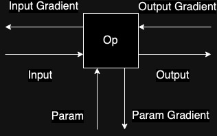

# Low Level Deep Learning
Deep learning from scratch...the hard way with C++.

Project aims: 
- Starting with hard-coded dense neural network compute all of the operations of a two layer network.
- Construct a generalised neural network framework that is able to perform any layer operations.
- Work our way up from dense, CNN, LSTM, transformer to constucting a LLM from scratch in with both CPU and GPU computing capabilities.  

## Dependencies
- Pybind11
- C++ 17
- CMake
- Eigen3 (Used as the C++ linear algebra library.)
- Conda/Pip (Meeting the Pybind11 requirments.)

## Build and Installation
The best way to setup the project is to (after installing dependencies) construct a new conda environment: 
```bash
conda create -n <MyEnvName> python=3.11
cd path/to/low-level-deep-learning/
pip install -e .
```
The pip setup step will run cmake and install the C++ framework and Python module simultaneously. 

## Simple Example Usage

The framework is best accessed directly from Python using Pybind11, however, can be used directly as a C++ API. 
```Python
import cppapi # Importing the neural network framework
import numpy as np
from sklearn.datasets import load_diabetes
from sklearn.model_selection import train_test_split
from sklearn.preprocessing import StandardScaler

diabetes = load_diabetes()
targets = diabetes.target.astype(np.float32)
data = diabetes.data.astype(np.float32)

# Normalise the data
scaler = StandardScaler()
data_scaled = scaler.fit_transform(data)
targets_ = targets.reshape(-1, 1)

# make a train test split
X_train, X_test, Y_train, Y_test = \
    train_test_split(data_scaled, targets_, test_size=0.2, random_state=42)

neurons = 1
lr = 0.01
epochs = 10
eval_every = 10
batch_size = X_train.shape[0]
restart = True
verbose = 2

nn = cppapi.NeuralNetwork2([
        cppapi.Layer2(cppapi.LayerType.Dense, 16, cppapi.ActivationType.Sigmoid),
        cppapi.Layer2(cppapi.LayerType.Dense, 16, cppapi.ActivationType.Sigmoid),
        cppapi.Layer2(cppapi.LayerType.Dense, 1, cppapi.ActivationType.Linear)
    ], 
    cppapi.LossType.MSE)

trainer = cppapi.Trainer(nn, cppapi.OptimiserType.SGD, lr)

trainer.fit(X_train, Y_train, X_test, Y_test, epochs, eval_every, batch_size, restart, verbose)
```

## Research Questions
The purpose of this code is to study facets of deep learning. In particular:
1. Scalability of operations from CPU, multiprocessing CPU, naive GPU, high throughput GPU:
    - Where are the boundaries? When should certain operations be done on the CPU vs GPU and are there times when CPU is better for deep learning than GPU. Does it all just depend on the matrix operations?


## Research Objectives
Ideas of things of interest:
1. sequential compute - data structures and memory analysis
2. parallel cpu compute with varying number of threads:
    1. Are different data structures required? Hypothesis is not because NN are implicitly sequential computation data structures and the best we can aim for is faster matrix multiplication.
    2. Examing the runtime as a function of threads for different problem sizes - what does the runtime optimisation curve look like
    3. Observe compute phenomena to examine bottlenecks in this process.
3. GPU compute

## Foundational CPU Development
This is a research framework.

This README is limited in scope to the introduction to the implementation methodology of the neural network. Further PDFs will be attached which discuss the GPU implementation as well as more complex layer definitions such as CNN, LSTM, and transformer architectures. 

The aim is not replace PyTorch or TensorFlow but to understand the operations and scalability of all operations of the neural network from scratch. Errors are not handled nicely :(.

The code base is divided into basics, located in `src/tutorial`, and the general neural network library, located in `src/nn2`. Basics are useful to understand the premise of this library including: 
- Demonstrate that the library is built on implementation of Eigen::Matrix<...> row-major floating point matrices and Eigen operations
- How does the cuda implementation work with the Python interface and communication with RowMajorXf matrix -> pointers
- Demonstrating the mechanics of forward/backward propagation through the 

On the other hand, things really start to get interesting in the general neural network implemnentation. Here, the focus is all about neural network operations, their implementation device strategy, and the corresponding necessary memory operations for computational efficiency. 

### Neural Network Operations

The layers of neural networks can be considered as a series of operations which are just some differentiable functions with an input and and output. The general idea of the operation can be summarised in the figure below. We have some input data into the operation and then compute ```output = f(x)``` where ```x``` is some data input. The parameter is how we control the optimisation of the neural network to approximate some function. For example, linear regression would just be a parameter ```W``` and ```Op``` would be ```mmul(X, W)```. This would then be followed by a bias operation which would be ```mmul(X, W) + beta```. Finally, we compute loss between forward pass and the supervised target using some loss function. In the backpropagation, we first differentiate each of the nueral network operations and then work backwards through each of them until we compute the entire chain of functions a.k.a. the chain rule.  

<div align="center">
 
</div>

So the question is how to represent this in a memory efficient manner. As a bit of context, I had originally implemented the neural network framework using class inheritence but this become unmanagement in terms of runtime and also effectively understanding how to debug.

To perform an operation we define a `struct` called `ParamOperation`, an `OperationType`, and two function `forward` and `backward` as follows:
```C++
enum OperationType {
    SIGMOID,
    LINEAR,
    WEIGHT_MULTIPLY,
    BIAS
};

struct ParamOperation {
    OperationType operationName;
    RowMatrixXf input; // This needs to be set
    RowMatrixXf output; // This needs to be calculated
    RowMatrixXf inputGrad; // This needs to be calculated on the backward pass
    RowMatrixXf outputGrad; // This needs to be set? maybe don't need
    RowMatrixXf param; // The param matrix is instantiated on construction
    RowMatrixXf paramGrad; // This needs to be calculated on the backward pass
    bool hasParam;
    ParamOperation(std::unique_ptr<RowMatrixXf> param_, OperationType instructions, bool has_param):
        operationName(instructions), hasParam(has_param),
        param(), input(), output(), inputGrad(), outputGrad(), paramGrad() {
        if (param_) {
            param = *std::move(param_);
        }
    }
};

void forward(ParamOperation& op, Eigen::Ref<RowMatrixXf> input);

void backward(ParamOperation& op, Eigen::Ref<RowMatrixXf> outputGrad);
```

The `forward` and `backward` functions are heavily dependent on the operation definition and are pre-defined by the framework using the `OperationType` to select the calculation to perform. 

The definition of the series of operations is defined by a neural network layer definition. For example the `Dense` neural network layer is made up of input-param dot product followed by the addition of a bias term to the input-param. The Layer is defined in this framework by implementing the following:

```C++
struct Layer {
    RowMatrixXf input;
    RowMatrixXf output;
    RowMatrixXf inputGrad;
    bool first_time_call;
    LayerType instructions;
    std::vector<operation::ParamOperation> operations;
    int neurons_;
    operation::OperationType activation;
    Layer(LayerType name, int neurons, operation::OperationType activation_): 
        first_time_call(true), instructions(name), neurons_(neurons), 
        input(), output(), activation(activation_) {}
};

void forward(Layer& layer, Eigen::Ref<RowMatrixXf> input);
void backward(Layer& layer, Eigen::Ref<RowMatrixXf> outputGrad);
void setupLayer(Layer& layer, Eigen::Ref<RowMatrixXf> input);
```

`LayerType` is used to define the instruction of the Layer. Three functions are then defined to implement the behaviour of the layer including `setupLayer`, `forward`, and `backward`. These functions are quite general so and therefore their imlementation can be discussed specifically. 

First, `setupLayer` is based on the input data to that layer and is called the first time `forward` is called. 

```C++
void setupLayer(Layer& layer, Eigen::Ref<RowMatrixXf> input) {
    switch (layer.instructions) {
        case LayerType::DENSE: 
        {
            // add a weight multiply followed by a bias addition
            RowMatrixXf W = RowMatrixXf::Random(input.cols(), layer.neurons_);
            RowMatrixXf B = RowMatrixXf::Random(1, layer.neurons_);
            layer.operations.push_back(operation::ParamOperation(
                std::make_unique<RowMatrixXf>(W), 
                operation::OperationType::WEIGHT_MULTIPLY, true));
            layer.operations.push_back(operation::ParamOperation(
                std::make_unique<RowMatrixXf>(B),
                operation::OperationType::BIAS, true));
            layer.operations.push_back(operation::ParamOperation(
                nullptr, layer.activation, false));
            break;
        }
        default:
            break;
    }
}
```

Second, the `forward` function goes through each of the operations in the layer passing and outputting data to the next operation. The `input` to the `forward` function is also stored as is is used later in the backward pass. Also, the output of the layer is also stored in the layer cache `layer.output` because it will be called as an input into the next layer in the neural network.  

```C++
void forward(Layer &layer, Eigen::Ref<RowMatrixXf> input) {
    // call setup layer if the layer has not yet been setup
    if (layer.first_time_call) {
        setupLayer(layer, input);
        layer.first_time_call = false;
    }

    layer.input = input;

    // need to keep updating the input
    for (int i = 0; i < layer.operations.size(); ++i) {
        if (i == 0) {
            operation::forward(layer.operations[i], input);
        } else {
            operation::forward(layer.operations[i], layer.operations[i-1].output);
        }
    }

    layer.output = layer.operations.back().output;
}
```

The `backward` function is then responsible for computing the `inputGradient` and `paramGradient` of the operations of the layer. 
```C++
void backward(Layer &layer, Eigen::Ref<RowMatrixXf> outputGrad) {
    // set the inputGrad at the end of backward
    int counter = 0;
    for (int i = layer.operations.size() - 1; i>=0; --i) {
        if(counter==0) {
            operation::backward(layer.operations[i], outputGrad);
            counter++;
        } else {
            operation::backward(layer.operations[i], layer.operations[i+1].inputGrad);
        }
    }
    layer.inputGrad = layer.operations[0].inputGrad;
}
```

The neural network data structure is defined as a class for convenience - it is much easier to interact with in Pybind11. In it, the loss function and layers are designed. Notice that we manage the memory ownership of the layers of the neural network explicitly here. The shared pointers are move to be owned by C++ runtime so that we don't have to refer back to python on every layer definition call. One of the important reasons for using Eigen as a linear alegbra library is convenient translation of the numpy C++ objects with Eigen. Numpy objects are implicitly converted using these functional signatures. By using `Eigen::Ref<T>` we don't even require copies of the array. This means that this framework has very few copies all the way down the call stack. The neural network data structure is also responsible for looping over the layers can feeding data through the layers of the neural network, as well as back propagating gradients back through the network. 

```C++
class NeuralNetwork {
public:
    NeuralNetwork(std::vector<std::shared_ptr<layer::Layer>> layers, loss::LossType loss):
    loss_(loss::LossFn(loss)) {
        for (int i = 0; i < layers.size(); ++i) 
        {
            layers_.push_back(std::move(layers[i]));
        }
    }
    void forward(Eigen::Ref<RowMatrixXf> input);
    void backward(Eigen::Ref<RowMatrixXf> lossGrad);
    void trainBatch(Eigen::Ref<RowMatrixXf> input, Eigen::Ref<RowMatrixXf> target);
    std::vector<std::shared_ptr<layer::Layer>>& getLayers() { return layers_; }
    float getLoss() { return lossValue; }
    Eigen::Ref<RowMatrixXf> getPredictions() { return predictions; }
    loss::LossFn& getLossFn() { return loss_; } 
protected:
    loss::LossFn loss_;
    RowMatrixXf predictions;
    float lossValue;
    std::vector<std::shared_ptr<layer::Layer>> layers_;
};
```


